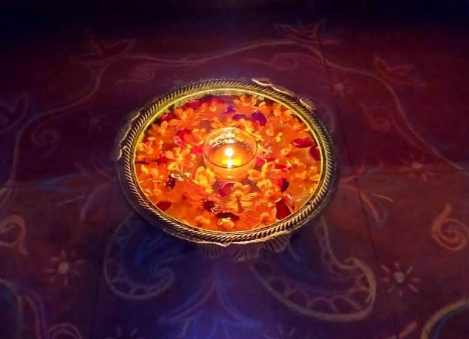
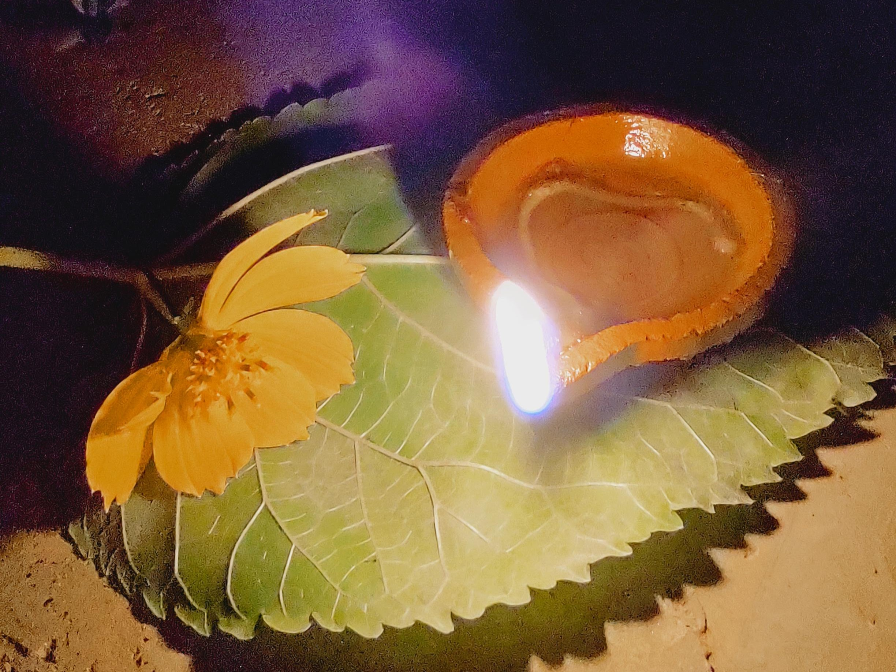

Deepavali — the festival of lights — brings families together in celebration, lighting up homes and hearts with joy. Whether you are a child or an adult, the essence of Deepavali is that it offers something for everyone, welcoming all backgrounds and traditions.

In many households, festival preparations are grand and collaborative, but having autistic children at home calls for a few additional steps to ensure their comfort and inclusion. For children with heightened sensory sensitivities, the bright lamps, vibrant fireworks, and loud crackers may provoke anxiety or distress. Recognizing and respecting your child's unique sensory profile is the foundation for a harmonious celebration.

## Meaningful Preparation and Participation

The flurry of festival work may tempt parents to keep children away from tasks, but involving them helps foster belonging and pride. Autistic children can actively participate in organizing, sorting, and decorating tasks such as:

- Arranging diyas or decorations
- Sorting festival supplies in baskets
- Setting up lamps in sequence
- Decorating gift boxes or envelopes

These hands-on activities allow children to contribute meaningfully while receiving appreciation from family members. There may be resistance to these new tasks—so it's important to schedule them thoughtfully, pace the experience patiently, and mark activities on a visual calendar several days in advance. Social stories can be used to explain what to expect and offer choices around participation.

If your child loves crackers, discuss safety using pictures or videos, and always supervise closely.

## Sensory Accommodations for Comfort

For children sensitive to lights, sounds, or busy environments, practical accommodations make a difference:

- Use softer, steady lighting if flickering lamps or serial lights cause distress.
- Avoid firecrackers indoors or in small spaces; limit them to quieter outdoor settings.
- Provide noise-cancelling headphones or ear defenders during fireworks or crowded gatherings.
- Choose peaceful times and neighborhoods for daily outings.
- Set up a tranquil, dimly lit room with familiar comfort objects as a retreat for sensory regulation.

If accommodations are insufficient, consider a getaway to a quieter locale, such as a farm. The health and peace of your child are the highest priorities—never push beyond their comfort zone.

## Navigating Crackers: Emotions and Understanding

Bursting crackers is woven into many childhood memories as a source of excitement and togetherness. As parents, it’s normal to feel disappointment if your autistic child cannot participate in the same way. Avoid projecting these feelings onto the child, and resist making crackers a measure of celebration.

Try gentle desensitization only with support from a therapist, and always pause if your child is uncomfortable. The experience should foster patience, acceptance, and respect for difference. Remember: autistic children are distinct individuals, as Kahlil Gibran wrote, “Your children are not your children... They come through you but not from you.” Their happiness arises from their own experiences—parents can offer opportunities, provide guidance, and step back with love and trust.

## Reflections

Deepavali celebrates light and hope—values that shine brightest when we honor each child’s needs, embrace differences, and build inclusive traditions. Let this festival be a time for togetherness, appreciation, and gentle guidance, for every member of the family.
